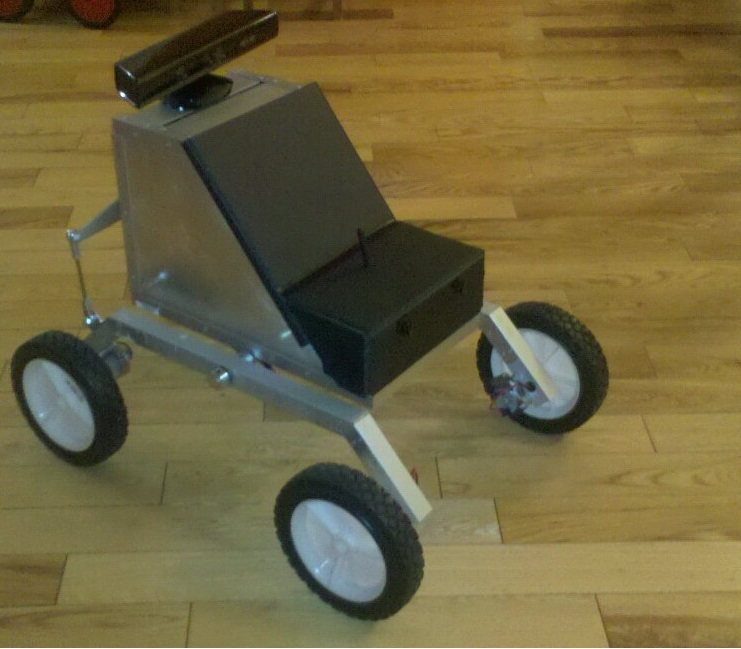

Previous experimental work conducted in 2009 with the Prairie Dog Unmanned Ground
Vehicle (UGV) taught numerous lessons in the shortfalls of assistant robotic platforms.
Although the UGV were able to conduct their primary tasks of remotely visually scouting
out an area, the performance came at the expense of debilitating the soldiers situational
awareness and abilities. Instead of augmenting the capabilities of the soldier, the UGV
decreased them. Taking the concept of creating a robot that will augment capabilities,
the development of a robotic platform called `Centaur' was conducted. The developments
started with marketing research and identication of required capabilities. This marketing
research identied the private security sector with a UGV acting in the role of sentry as
the application with the greatest potential to fully augment a human-robot collaboration.
However, to fully augment a private security guard the UGV faced some new technological
challenges that required additional research and development (R & D). This R & D focused
on a number of areas. Research into the readily available required components for the UGV,
with investigations into their true capabilities. The design, construction, and analysis of the
chassis. Along with software implementation of a user interface utilizing a distributed data
system. Giving the UGV the ability to move freely in smooth and rough terrain, navigate
indoors and out, listen for sounds of interest, localize the sound source, and navigate to
that location. The combination of such abilities on the Centaur UGV platform augment the
capabilities of private security personnel through a form of human-robot collaboration.

