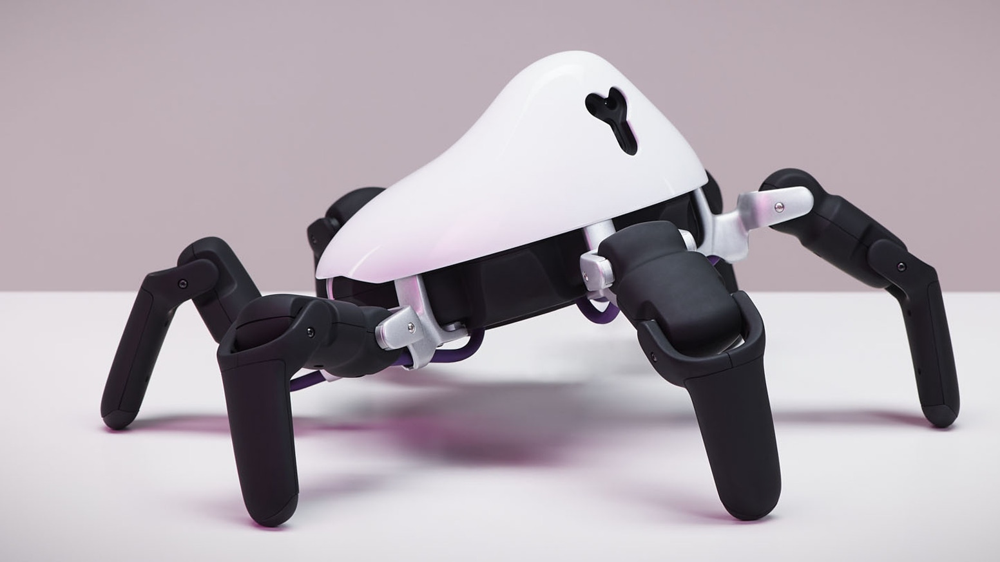
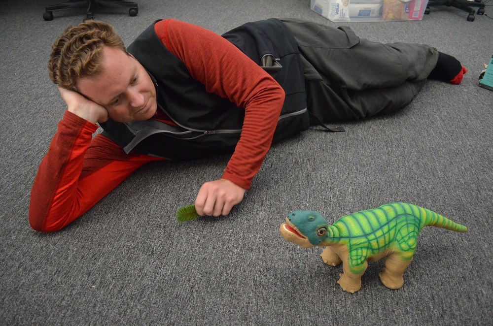
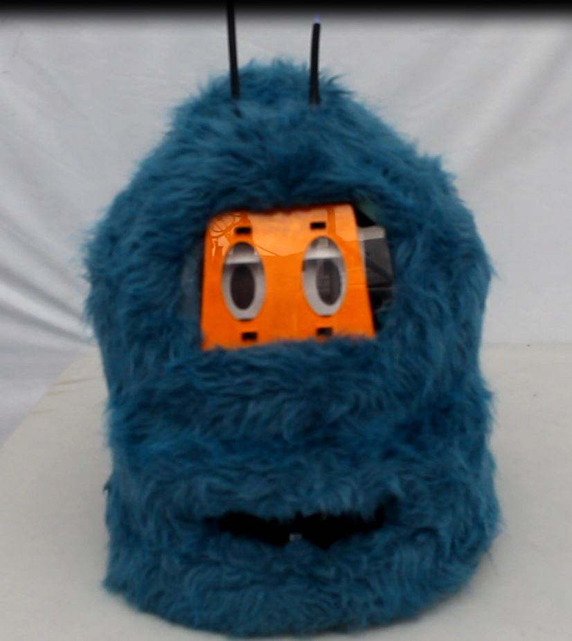
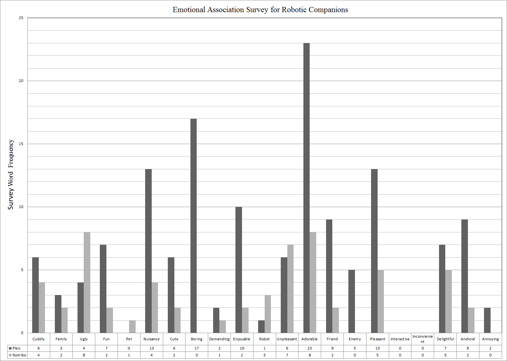

 

Imagine living for four months in total isolation with six other humans, all locked up in an advanced facility that simulates life on Mars. That was the goal of the Hawaii Space Exploration Analog and Simulation (HI-SEAS) project, and I was one of the lucky individuals to take part in this experiment. For the HI-SEAS application, each individual was expected to propose their own research project. I suggested a study in robotic companions as a method to reduce stress in an isolated environment. 

 

 

Humans on missions to Mars, asteroids, or beyond, will be separated from friends, families, and social stimuli for months or years at a time. They’ll be in a mentally and physically demanding environment, often with minimal personal space. This has the potential to create constant emotional stress, and it’s important to have some sort of healthy way to deal with that stress. It has been well established that domestic pets can provide a great deal of stress relief and create emotional bonds with their owners. Obviously, it’s not very practical for domestic animals to accompany long-term space missions, but robotic companions might be able to help fill that role.

  

A robotic companion is a robot that is designed to be easy and compelling for humans to form bonds with. Robotic companions are most often animals or animal-like, and examples include Pleo (a robotic baby dinosaur) and Romibo (a shaggy little robot with big eyes). Rather than interacting with humans through text or voice, robotic companions rely on more abstract techniques that would be familiar to any pet owner, including sound, movement, and touch. Essentially, the hope is that a robotic companion would be able to fulfill much of the emotional space that a real pet would, without requiring resources or maintenance. And if strong emotional bonds are formed from the astronaut to the robot, then there is a potential that the interaction will have numerous substantial positive psychological impact when dealing with stress and loneliness.

  

My project on the HI-SEAS mission was to design and program (mostly in C++) robotic personalities and implement a preliminary experimental study. The study tested two types of personalities within two different robotic platforms: a demanding personality requiring attention, and a passive personality that would wait for crew members to initiate interaction. The crew members were assigned a robot for a period of time, uploaded with the aggressive and passive personalities. Each crew member was given a survey to fill out after initially interacting with the robot platform. The survey was used to assess the type of experience the crew member had, and to learn about any changes the person would like to see.

 

