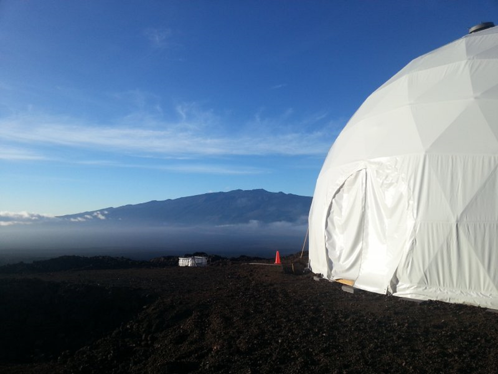

The HI-SEAS Habitat is semi-portable, low-impact, and designed to have all the desirable analog features specified in Keeton et al (2011). It has a habitable volume of ~13,000 cubic feet, a usable floor space of ~1200 square feet, and small sleeping quarters for a crew of six, as well as a kitchen, laboratory, bathroom, simulated airlock and ‘dirty’ work area. 
The HI-SEAS site has Mars-like geology which allows crews to perform high-fidelity geological field work and add to the realism of the mission simulation.

I participated in the first mission as a test subject acting as the HI-SEAS Crew Engineer for four months. Since then I have helped organize, handle logistics, and mission operations while conducting experiements of my own. My research into energy consumption forecasting comes from the sensors of the habitat that I used to complete my Masters degree. I am basing my PhD work on life inside the habitat by taking advantage of the qualative and psycological data.

